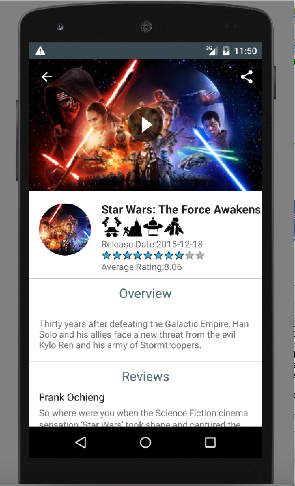
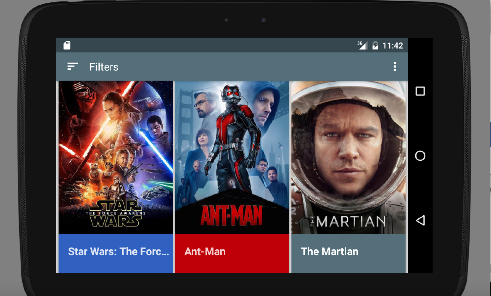

# Popular-Movies-App

## Description

This repository contains the files for the popular movies application for the android nanodegree. Both the stages of the app will be built within the same master branch. After I have updated the code base with the required functionalities, I will create the branches.

## Features

This app can perform the following functionalitites:

- Dicover movies with high popularity, vote count and highest rating.
- Watch Trailers
- Read Reviews

## Upcoming Features

The following are the ToDos for the next release of the application

- Favourite movies
- Display Cast
- Find Similar movies based on current favourites
- Setting to filter on adult movies

## Running the Project

Simply, pull the project and provide the api key in the following path:
    ```
    app/build.gradle
    ```

## Screens

Phone Movies Landing  				  | Phone Movies Detail
--------------------------------------| -------------
	  | 

Tablet Movies Landing  				  | Tablet Movies Detail
--------------------------------------| -------------
	  | 

## Libraries Used

### View Binding 
* [ButterKnife](https://github.com/JakeWharton/butterknife)

### API Requests and Image Enhancements
* [Retrofit](https://github.com/square/retrofit)
* [RxJava](https://github.com/ReactiveX/RxJava)
* [RxAndroid](https://github.com/ReactiveX/RxAndroid)
* [Picasso](http://square.github.io/picasso/)

### Dependency and Module Injection
* [Dagger](https://github.com/square/dagger)

### Custom View Libraries
* [Android-ObservableScrollView](https://github.com/ksoichiro/Android-ObservableScrollView)

### Android Native View Libraries
* [Android Recycler View] (http://developer.android.com/reference/android/support/v7/widget/RecyclerView.html)
* [Android Cards View] (http://developer.android.com/training/material/lists-cards.html)
* [Android Colour Pallete] (http://developer.android.com/reference/android/support/v7/graphics/Palette.html)

## Artwork Used for Genres

I would like to specially thank the noun project and the following people for making their logos open source and free to use
- [Yi Chen](https://thenounproject.com/jsczcy/)
- [Simon Mettler](https://thenounproject.com/SimonMettler/)

Please give due credit to these individuals when using the artwork. 


